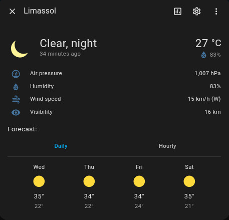
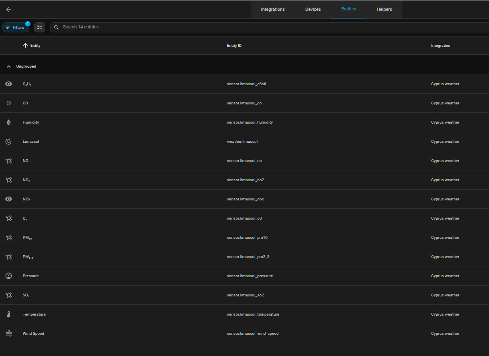
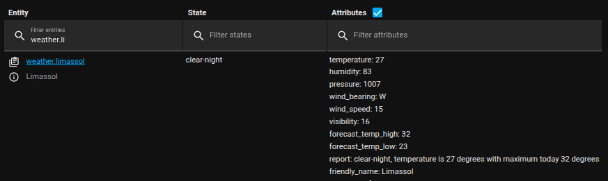

# Home Assistant Cyprus Weather integration

## Description
Get Cyprus weather data from cyprus weather org site and display it in Home Assistant as a weather integration including forecast data and outside air quality.

## Installation
Integration can be installed manually by manually copying the integration to the custom_integration folder, or alternatively installed with HACS

### A. HACS Installation (Recommended)
Now this integration can alternatively be easily installed with hacs as well, this is the recommanded way. This way you will also get all future release updates. More information about hacs on 
https://hacs.xyz/docs/basic/getting_started

1. Add the repo as a custom repository in hacs  
   https://github.com/xumxum/ha_cyprus_weather

2. Download Cyprus Weather integration in hacs

3. Restart Home Assistant

4. Search & Add the `Cyprus Weather` integration in Settings/Integration and configure the city.

Entity name will be `weather.city` (ex `weather.nicosia`)

Possible cities:
- Nicosia
- Limassol
- Larnaca
- Paphos
- Ayia Napa

### B. Manual Installation
1. clone repo to a working directory
> git clone https://github.com/xumxum/ha_cyprus_weather.git

2. Copy(or link) `./custom_components/ha_cyprus_weather` to your  HA custom_components directory

3. Restart Home Assistant
 
4. Search & Add the `Cyprus Weather` integration in Settings/Integration and configure the city.

## Upgrading from version < 2.0.0
Remove all configurations from `configuration.yaml`, addon now fully GUI configured. Also addon now creates additional sensors for temperature, humidity, wind speed and pressure, so remove all template sensors in case you added them, now it's automatic :)

## Notes

For all the information it returns check all the sensors in the integration section and the `weather.city` attributes in the developer section.

The `report` attribute is a weather report for the day, with current temperature, wind and rain forecasting (if it is foreseen) that can be sent to the user or used in a text-to-speach automation(for ex in the morning)

## Screenshots

